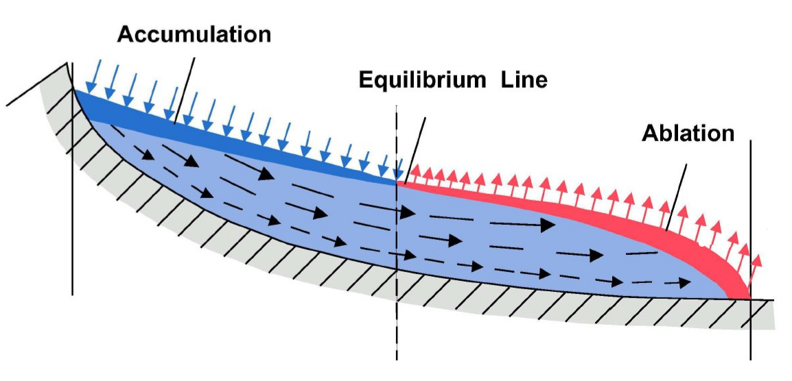
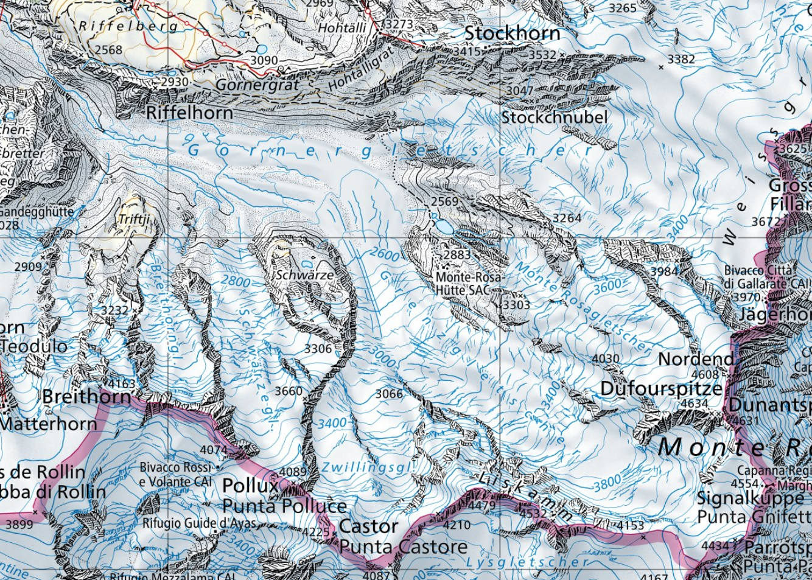

# Toy-project: a glacier mass balance model applied to Breithorngletscher (Zermatt, Switzerland)

Glaciers exist because in their accumulation zone, more snow falls than melts.  Thus snow accumulates, densifies into ice which then flows down into the ablation zone where there is more melt than snowfall.

*Figure:* Sketch of a glacier with accumulation and ablation zone and ice flow between them

Our toy model is a simple mass balance model, i.e. modelling how much volume a glacier gains and how much it looses (ice flow is not modelled).  This toy model is then applied to Breithorngletscher to turn this into a toy research project.

The way this will be done is via a set of guided [tasks](tasks.md).  Below a high level overview of the project.

## The model

- temperature at a certain elevation is taken as given (typically from measurements of a weather station).  To calculate temperature at other elevations a simple linear lapse rate is used.
- precipitation is prescribed with no elevation correction
- the glacier is defined with a digital elevation model (DEM), but at the end we just care about the elevation of each grid cell and not their spatial relation

Given this data we can then calculate for a particular elevation:
- melt with a temperature index model which states that melt scales linearly with air temperature T if T>0 otherwise there is no melt
- accumulation: if temperature is below a threshold temperature, otherwise it is ignored

The sum of melt and accumulation is then the net balance.  The net balance can be summed over the whole glacier, to get the glacier-wide balance, and/or over time to get the total (glacier-wide) balance.

### Why this model

This is a simple, tangible model thus easy to understand and program.  Nonetheless, it can illustrate good practices in

- writing good code
- using git to keep track of the progress and for collaboration
- handling of input datasets (melt, precip, DEM, glacier mask)
- produce some output (figures, tables)

## Applying it to Breithorngletscher

Breithorngletscher is a small-ish glacier near Zermatt and also near the real weather data we will use in this toy-project.

*Figure:* Map of Breithorngletscher and Gornergletscher (swisstopo)

### The data

As we probably all know, dealing with real data often takes a long time as there always seems to be something amiss or a bug somewhere in the pipeline.  Thus to make life a bit easier (but not too easy), I pre-prepared some data for this and put it here
https://github.com/mauro3/CORDS/tree/master/data/workshop-reproducible-research

I distinguish between "own" data and "foreign" data.  This is useful as the own data we can definitely publish as we like, whereas with the foreign data we have to be more careful (does it need to be re-publised? Would it's license allow it?)

- the DEM is a cropped version of the DHM200 of swisstopo (foreign data)
- the mask is derived from the Swiss Glacier Inventory 2020 https://doi.glamos.ch/data/inventory/inventory_sgi2016_r2020.html . But here we pretend we digitised the glacier boundary ourselves, thus it is "our" data
- the temperature data, measured during my PhD (Mauro's) just off Gornergletscher (own data)
