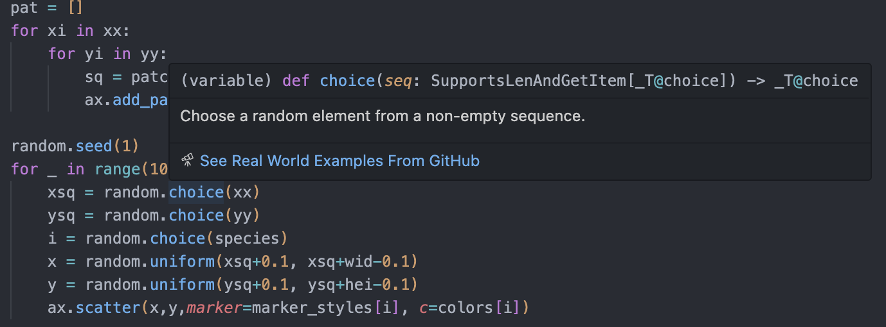
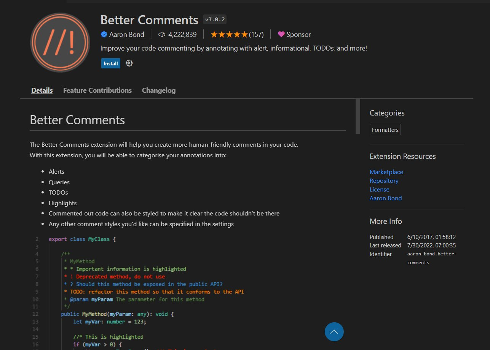
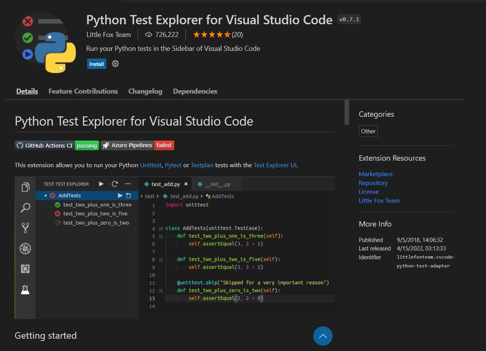

## Documentation
Documentation serves many purposes and many audiences, including

- future self
- collaborators
- users
- contributors

### Style guides
- Use styles guides for the language you are using
- Correcly name your variables

> There are only two hard things in Computer Science: cache invalidation and naming things.
*Martin Fowler*


- Do not hesitate to refactor your code, delete dead code, etc... otherwise you will get others and yourself lost!

### Comments
- Single line comments
- Multi-line comments

##### julia
```
#=
This is a multline 
comment
=#
```

### Literal documentation

- helps users understand what your tool does and how to get started using it.

#### README
- The file that is displayed on github repo
- Should contain
  - (Badges showing tests, and a nice logo)
  - A *Description* of what does this repo correspond to
  - An overview of the repo structure and files
  - Potentially a *Getting started* or *Examples*
  - An *Installation* section, with dependencies
  - A *Citation*/*Reference* section
  - (A link to the *Documentation*)
  - (A *How to contribute* section)
  - An *Acknowledgement* section

##### Some examples
- [HighDimPDE.jl](https://github.com/SciML/HighDimPDE.jl)
- [Code for HighDimPDE paper](https://github.com/SciML/HighDimPDE.jl)
- [Code for PiecewiseInference paper](https://github.com/vboussange/partitioning-time-series)
- [SatClip](https://github.com/vboussange/partitioning-time-series)
- [GraphCast](https://github.com/google-deepmind/graphcast)
- [Alphafold](https://github.com/google-deepmind/alphafold)


### API documentation / doc strings
API documentation describes the usage for each piece of your code

- Support markdown styles
  - backticks for variable names
  - `#` for titles,
  - ...
- Doc strings in python live inside the function
- They can also document modules

```python
def best_function_ever(a_param, another_parameter):
    """
    this is the docstring
    """
    # do some stuff
```

- But above the function or type definition in Julia
```julia
"""
this is the docstring
"""
function best_function_ever(a_param, another_parameter)
# do some stuff
end

"Tell whether there are too foo items in the array."
foo(xs::Array) = ...
```

#### Best practice
- (in Julia: insert the signature of your function )
- Short description 
- Arguments (Args, Input,...)
- Returns
- Examples

###### python
```python
def add(a, b):
    """
    Adds two integers.

    This function takes two integer arguments and returns their sum.

    # Parameters:
    a: The first integer to be added.
    b: The second integer to be added.

    # Returns:
    int: The sum of the two integers.

    # Raises:
    TypeError: If either of the arguments is not an integer.

    Examples:
    >>> add(2, 3)
    5
    >>> add(-1, 1)
    0
    >>> add('a', 1)
    Traceback (most recent call last):
        ...
    TypeError: Both arguments must be integers.
    """
    if not isinstance(a, int) or not isinstance(b, int):
        raise TypeError("Both arguments must be integers")
    return a + b
```

##### julia
````julia
"""
    add(a, b)

Adds two integers.

This function takes two integer arguments and returns their sum.

# Arguments
- `a`: The first integer to be added.
- `b`: The second integer to be added.

# Returns
- The sum of the two integers.

# Examples

```julia-repl
julia> add(2, 3)
5

julia> add(-1, 1)
0
```
"""
function add(a, b)
    return a + b
end
````

- You may use fancy tools (e.g. `Documenter.jl`) to automatically render your API documentation on website, together with extra literal documentation that may be placed in a `docs` folder. 
  - readthedocs
  - Github actions can automatize the process of building the documentation for you.

#### Typing
Typing refers to the specification of variable types and function return types within a programming language. It helps define what kind of data a function or variable can handle, ensuring type safety and reducing runtime errors.

-  Clearly indicates the expected input and output types, making the code easier to understand.
-  Helps catch type-related errors early in the development process.
-  Encourages consistent usage of types throughout the codebase.

##### python
```python
def add(a: int, b: int) -> int:
    return a + b
```
- do not enforce type checking at runtime!
- you may use decorators to enforce them

##### julia
```julia
function add(a::Int, b::Int)
    return a + b
end
```
- types are enforced at runtime!
- type annotations can help the Julia compiler optimize performance by making type inferences easier.

#### Consider raising errors
- People don’t read manuals. That includes you. What people do read are error messages. Consider the following function stub, which is meant to convolve two vectors together:

##### python
- `assert`: When an assert doesn’t pass, it raises an AssertionError. You can optionally add an error message at the end.
- `NotImplementedError`, `ValueError`, `NameError`: Commonly used, generic errors you can raise. I probably overuse `NotImplementedError` compared to other types.


### Tutorials 
- vignettes in R
- but more generally, Tutorial jupyter notebooks on using the code 

### Accessing documentation 

##### julia

```julia
?cos
?@time
?r""
```

##### python

```python
help(myfun)
```

But e.g. VSCode can be also quite helpful, and this works also with your own code!




### Doc testing
Doc testing, or doctest, allows you to test your code by running examples embedded in the documentation (docstrings). It compares the output of the examples with the expected results given in the docstrings, ensuring the code works as documented.

#### Why doc testing
- Ensures that the code examples in your documentation are accurate and up-to-date.
- Simple to write and understand, making it accessible for both writing and reading tests.
- Promotes writing comprehensive docstrings which enhance code readability and maintainability.

##### Python
```python
def add(a, b):
    """
    Adds two numbers.

    >>> add(2, 3)
    5
    >>> add(-1, 1)
    0
    """
    return a + b
```

```
python -m doctest your_module.py
```
or from within a script
```python
if __name__ == "__main__":
    import doctest
    doctest.testmod()
```

##### julia
Available through `Documenter.jl`

````julia
"""
Adds two numbers.

```jldoctest
julia> add(2, 3)
5

julia> add(-1, 1)
0
```
"""

function add(a, b)
    return a + b
end

````

### More resources
- [Julia documentation](https://docs.julialang.org/en/v1/manual/documentation/#Writing-Documentation)
- [Good research on documentation](https://goodresearch.dev/docs)


- https://carpentries-incubator.github.io/python-packaging-publishing/05-documentation-types-roles/index.html
- https://carpentries-incubator.github.io/python-packaging-publishing/06-documentation-in-code/index.html

### Useful packages
- Better Comments

- Automatic doc string generation

- Python test explorer



### Take home messages
- Types of documentation include: literal, API, and tutorial/example
- Literal Documentation lives outside the code and explains the big picture ideas of the project and how to get it ste up
- API documentation lives in docstrings within the code and explains how to use functions in detail
- Examples are scripts (or notebooks, or code excerpts) that live alongside the project and connect between the details and the common tasks.
- Consider using ChatGPT to get started with documenting your functions